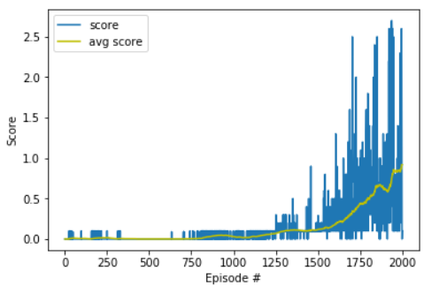

## MADDPG Algorithm - Collaboration - Competition

In this project, two RL players will be trained to play tennis against one another. Similarly to real tennis, each player has the goal of maintaining possession of the ball. A match between two evenly matched opponents is typically characterized by long exchanges of passes over the net between the players.  

### Model Architecture
We are using Multi-Agent Deep Deterministic Policy Gradient in this project. There are two neural networks utilized in the actor-critic algorithm, one for the actor and one for the critic. These networks calculate action vectors for the current state and generate a temporal-difference error signal at each time step.
To ensure good exploration, DDPG employs a stochastic behavioral policy, whereas to estimate, a deterministic target policy is used.
Two deep neural networks (actor-critic) are used in the algorithm:

In summary these two deep neural structure are as below (See model.py):

- Actor    
    - Hidden: (input, 128)  
    - Hidden: (128, 128)    
    - Output: (128, 2)      

- Critic
    - Hidden: (input, 128)              
    - Hidden: (130, 128)  
    - Output: (128, 1)                  

### DDPG Algorithm
The Agent is included in ddpg_agent algorithm and upon reaching a reward value of 0.5, it returns
the score and the final episode.

### Hyperparameters
- BUFFER_SIZE = int(1e5)  # replay buffer size
- BATCH_SIZE = 128        # minibatch size
- GAMMA = 0.99            # discount factor
- TAU = 1e-3              # for soft update of target parameters
- LR_ACTOR = 2e-4         # learning rate of the actor 
- LR_CRITIC = 2e-4        # learning rate of the critic
- WEIGHT_DECAY = 0   # L2 weight decay

## Results
The agent achieved an average score of 0.5055 in episode number 1796.

